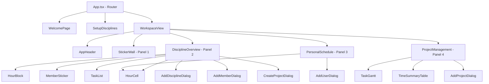
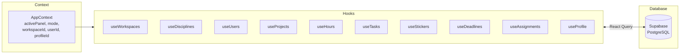
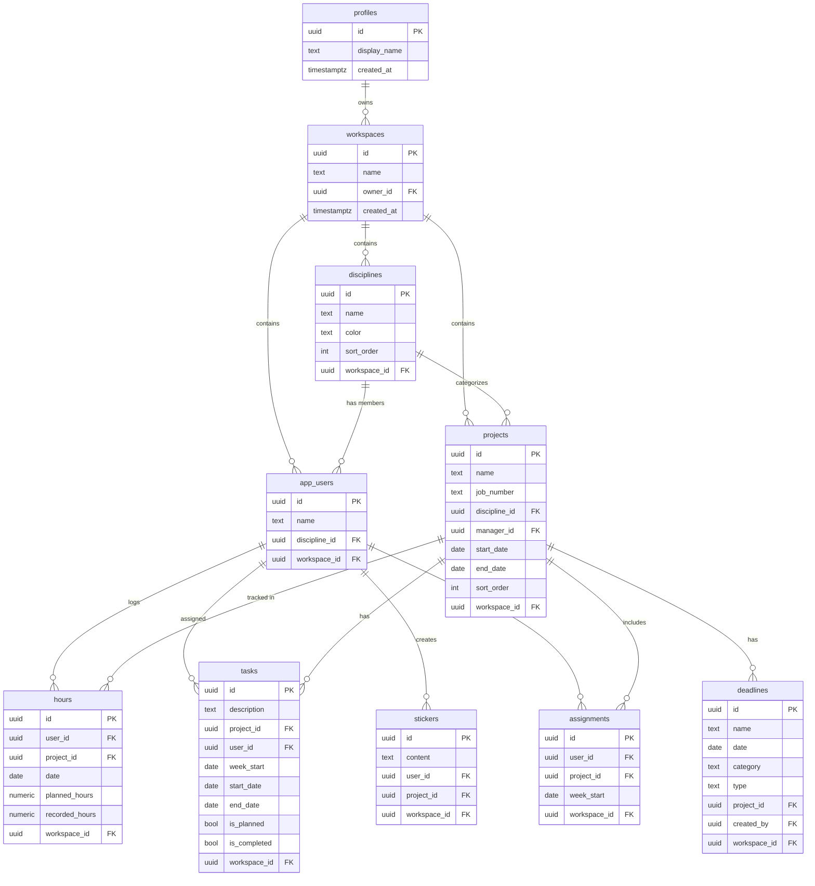

# Architecture Document — Chief Project Manager v1.0.0

## Technology Stack

| Layer | Technology |
|-------|-----------|
| Frontend | React 18, TypeScript, Vite |
| Styling | Tailwind CSS, shadcn/ui |
| State Management | TanStack React Query |
| Routing | React Router v6 |
| Backend | Supabase (PostgreSQL, Edge Functions) |
| Charts | Recharts |

---

## Component Hierarchy

---

## Data Flow

---

## Database Schema (ER Diagram)

---

## Hook Patterns

All data hooks follow a consistent pattern:
1. **Query hooks** (`useProjects`, `useUsers`, etc.) — filter by `workspace_id` from `AppContext`
2. **Mutation hooks** — use `useMutation` with `onSuccess` invalidation of the parent query key
3. **Upsert pattern** — hours use upsert logic to handle create-or-update in a single operation
4. **Plan/Record sync** — when creating planned hours, `recorded_hours` is auto-populated as baseline

## Edge Functions

| Function | Purpose |
|----------|---------|
| `analyze-stickers` | AI-powered analysis of sticker content |
| `match-project` | AI-powered project matching from sticker text |
